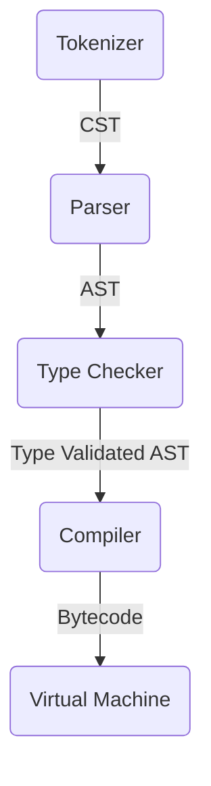

# TyPy

_**Ty**ped **Py**thon_

> ⚠️ Under Development

A programming language inspired by Python. The goal is to build clean and maintainable code using the best of the Python ecosystem. The language is:

1. **Statically Typed** — catches type errors at compile time
2. **Simple** — minimal syntax and semantics
3. **Small** — focused feature set with predictable behavior

## Features

- Static type system with `int` and `bool` types
- Python-like syntax with indentation-based blocks
- Conditional statements (`if` / `elif` / `else`)
- Arithmetic and comparison operators
- Stack-based bytecode virtual machine
- Interactive REPL for quick experimentation
- File execution with filename validation

## Quick Start

### Execute a File

Create a file `example.tp` with snake_case naming:

```python
a: int = 10
b: int = 20
result: int = a * b
```

Run it with:

```bash
$ typy example.tp
200
```

TyPy enforces filename must have the `.tp` extension.

### Interactive REPL

We also support an interactive REPL:

```bash
$ typy
=== TyPy (v 0.1.0) ===
>>> a: int = 10
10
>>> b: int = 20
20
>>> b * a
200
```

## Contributing

### Architecture

The language is written in Rust using a stack-based virtual machine. All code goes through the following pipeline:



### Making PR

Before submitting a PR, ensure your code passes:

1. Formatted `cargo fmt --all -- --check`
2. Linted `cargo clippy --locked --all-targets --all-features -- -D warnings`
3. Tested `cargo test --locked --all-features --verbose`
4. Built `cargo build --locked --verbose`

You can use `just` for quick check `$ just check-all`

## Execution semantics

- `int` is a signed 64-bit integer. Arithmetic overflow raises `OverflowError`
  in both debug and release builds; division by zero raises `ZeroDivisionError`.
- Variables declared in a block are lexical locals. Nested blocks read and write
  the nearest declaration, and a shadowing declaration does not modify globals.
- Each REPL submission is atomic: a type or runtime error leaves existing global
  values and declarations unchanged, including writes before the failing statement.
  A failed initializer can be retried. Interned symbol IDs remain allocated.
- The displayed result is the last expression statement actually executed in the
  submission. Assignments and declarations are silent. Empty submissions have no
  result; operand values and temporary block frames do not survive a run.
- Equality supports matching `int` or `bool` operands; ordering requires `int`.
- Simple statements require newlines. Blank lines in files do not affect block
  indentation; LF and CRLF are equivalent. A blank line submits a REPL block;
  EOF executes pending input (or reports a syntax error if it is incomplete).
- Library clients handling untrusted source should use
  `tokenizer::try_tokenize_str`, which returns `Result`. The legacy `tokenize`
  and `tokenize_str` wrappers retain their panic-on-error behavior.
