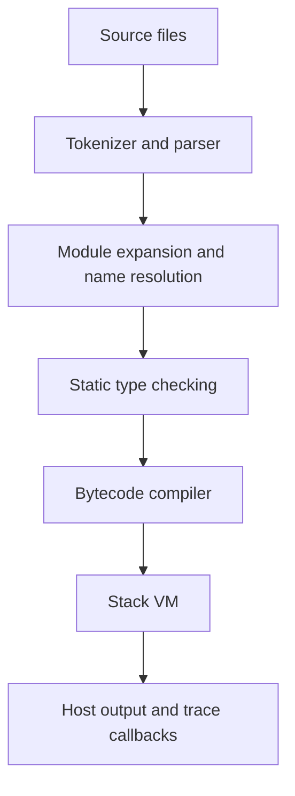

# Interpreter internals

## Pipeline

Standalone `Interpreter` submissions skip module expansion. `Program::compile`
links a complete executable and appends a checked call to its entry. Compilation
has no VM output. A `Program` can run repeatedly; each run creates fresh state.

## Syntax and modules

`tokenizer` scans borrowed source into owned tokens, including explicit newline,
indent and dedent markers. `parser` uses recursive descent and precedence levels
to produce `ast::{Expr, Stmt, FunctionDef}`. Import syntax has its own parser module.
Dotted type annotations are resolved later, not interpreted as runtime attributes.

`modules::linker` asks a host `ModuleLoader` for source text and a canonical name.
It performs depth-first expansion at the import's position, maintains an active
stack for cycle diagnostics and caches completed module namespaces. Dependencies
are emitted once. The CLI's `FileLoader` handles disk lookup, library `lib.tp`
entries, ambiguity and project-root containment; none of that requires `std` in
core code.

`modules::names` rewrites global references and nominal annotations to canonical
`module::name` identities. Local scopes preserve explicit shadowing and nearest
binding assignment. Imported aliases reference existing identities; qualified
namespace accesses become direct names before the type checker sees them.
Imports disappear from the executable AST. Dependencies' private implementation
names are not injected into the importer's source scope. There is no runtime
module dictionary, import hook or dynamic linker.

## Static types and compilation

`TypeChecker` walks declarations in source order using a stack of symbol-to-type
maps. `Interner` assigns compact `SymbolId`s to names. Inferred first assignments
become typed declarations; the compiler must consume the returned resolved AST.
A clone of the checker makes failed checks transactional.

Scalar types are exact. User instances have nominal class identity; functions and
bound methods have structural parameter/result signatures. Classes record field
types and all method signatures before checking method bodies. Non-`None` functions
require return-path coverage. Native builtin calls have explicit checker rules;
`print` accepts any checked values and returns `None`.

`Compiler` emits instructions into a vector. Globals use `LoadName`/`StoreName`;
locals use frame slots, with lexical depth for enclosing blocks. Conditional
branches use patched `Jump`/`JumpIfFalse` offsets. Expression statements consume
their value into a result register; they do not leave stale operands or print.
`Call` carries an argument count, and `Return` unwinds the active function.
`GetAttribute`, `SetAttribute` and `CreateClass` handle user objects.

Function bodies become `Rc<FunctionCode>` containing instructions, arity and local
slot count. Class metadata stores fields and method code. Runtime imports do not
exist: a checked program is self-contained bytecode plus its symbol interner.
The public low-level compiler assumes a resolved, type-checked AST; use high-level
APIs for unvalidated source.

## Objects and execution

Every `Object` owns an `Rc<ObjectData>` with an immutable type header and a tagged
payload. Payloads include integers, booleans, `None`, native/user functions,
classes, instances and bound methods. Builtin descriptors are static; user
instances own their class descriptor through `Rc`. All descriptors have `type`
as metatype. This takes the common-header idea from CPython, without adopting its
C ABI or dynamic typing.

Instance fields use `RefCell<BTreeMap<...>>`; their names and types are fixed.
A bound method owns its receiver and method code. Functions reference globals by
symbol, not by retaining an environment. Earlier-class-only field types make the
ownership graph acyclic, so reference counting is sufficient without a tracing GC.
Handles are single-threaded and need no atomic reference counting or unsafe code.

The VM keeps an operand stack, a globals table, lexical frames and an explicit
activation stack. Each activation saves code/IP, frame and operand baselines,
result register and optional constructor result. A call creates a parameter frame;
a return truncates temporary frames and operands, restores the caller and pushes
the returned object. Constructors return the new instance after `__init__`.
Recursive language calls do not recurse through Rust function calls.

Native callables dispatch through `builtins`. `print` formats one line and invokes
the host callback. It consumes no user-function activation. Trace callbacks borrow
VM state after successful instructions. Globals and an undo journal provide
[transactional recovery](errors.md); output is deliberately immediate.

## Code ownership

| Modules | Responsibility |
| --- | --- |
| `ast`, `tokenizer`, `parser` | Syntax |
| `modules/{linker,names}` | Dependency expansion and namespace resolution |
| `types/{definitions,value}` | Signatures, classes, inference and static checks |
| `compiler`, `bytecode` | Bytecode and callable metadata |
| `object/{descriptors,instances,operations}` | Object identity, storage and operations |
| `builtins`, `vm/{mod,calls}` | Native calls, VM execution and rollback |
| `interpreter` | Persistent standalone evaluation |
| `cli/{config,loader,session,repl}` | Arguments, filesystem policy, presentation, input |

Behavior tests cover positive cases and static failures, module CLI tests exercise
real files, and Markdown examples test the documentation. CI runs debug/release
and core-only tests, formatting, Clippy and embedded cross-compilation. Physical
hardware execution and allocation-failure recovery are not claimed by these checks.
